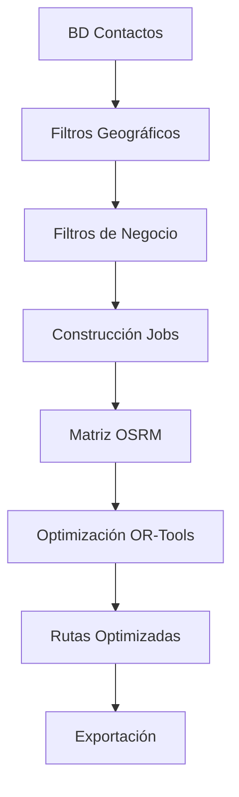

# 🚛 Sistema VRP de Optimización - Documentación Completa

## 📖 Descripción General

El Sistema VRP (Vehicle Routing Problem) es una solución completa de optimización de rutas de vehículos que combina:
- **OR-Tools**: Solver avanzado de Google para problemas de optimización
- **OSRM**: Open Source Routing Machine para cálculo de rutas reales
- **Streamlit**: Interfaz web interactiva para visualización y control
- **Folium**: Mapas interactivos con rutas y puntos de interés

## 🏗️ Arquitectura del Sistema

### Módulos Principales

```
ROUTING_MAPS/
├── vrp/                           # Paquete principal VRP F1
│   ├── __init__.py               # API pública del sistema
│   ├── vrp_system.py            # Coordinador principal del sistema
│   ├── solver/                   # Optimización OR-Tools
│   │   ├── ortools_solver.py    # Solver avanzado con restricciones
│   │   └── or_tools_openvrp.py  # Solver de rutas abiertas
│   ├── matrix/                   # Cálculo de matrices de distancia/tiempo
│   │   ├── osrm.py              # Cliente OSRM para rutas reales
│   │   └── osrm_client.py       # Cliente optimizado con cache
│   ├── paths/                    # Cálculo de rutas detalladas
│   │   └── osrm_route.py        # Geometrías de rutas con polylines
│   ├── export/                   # Exportación multi-formato
│   │   └── writers.py           # CSV, GeoJSON, mapas HTML
│   └── utils/                    # Utilidades y configuración
│       ├── config.py            # Configuración del sistema
│       └── cache.py             # Sistema de caché para optimización
├── pre_procesamiento/            # Preprocesamiento de datos
│   ├── prepro_ruteo.py          # Construcción de escenarios VRP
│   └── prepro_visualizacion.py  # Carga de datos desde BD
├── pages/                        # Interfaces Streamlit
│   ├── 10_ruteo_piloto.py       # Construcción de agenda semanal
│   └── 11_vrp_optimization.py   # Optimización avanzada VRP
└── app_vrp.py                   # Aplicación principal de visualización
```

## 🔧 Componentes Técnicos

### 1. Sistema VRP Principal (`vrp/`)

#### VRPSystem - Coordinador Principal
**Archivo**: `vrp/vrp_system.py`

```python
from vrp import VRPSystem

# Inicialización
vrp_system = VRPSystem(
    osrm_server="http://localhost:5000",  # Servidor OSRM
    cache_enabled=True                    # Habilitación de caché
)

# Verificar estado del sistema
status = vrp_system.get_system_status()
print(status['osrm_status'])  # True/False
print(status['ortools_status'])  # True/False
```

**Funciones principales**:
- `solve_vrp()`: Optimización completa con múltiples vehículos
- `solve_tsp()`: Problema del viajante (un solo vehículo)
- `get_system_status()`: Verificación de componentes
- `export_solution()`: Exportación en múltiples formatos

#### OR-Tools Solver - Optimización
**Archivo**: `vrp/solver/ortools_solver.py`

Solver avanzado con restricciones:
- **Capacidades de vehículos**: Límites de carga por vehículo
- **Ventanas de tiempo**: Horarios de atención por cliente
- **Tiempos de servicio**: Duración de atención por parada
- **Rutas abiertas**: Sin retorno obligatorio al depósito
- **Múltiples depósitos**: Diferentes puntos de inicio/fin

```python
solver = ORToolsVRPSolver(
    max_vehicles=10,
    time_limit=300  # 5 minutos
)

solution = solver.solve_vrp(
    locations=df_locations,
    distance_matrix=distance_matrix,
    time_matrix=time_matrix,
    vehicle_capacities=[100, 100, 80],
    location_demands=[5, 10, 7, 12],
    open_routes=True
)
```

#### OSRM Integration - Rutas Reales
**Archivo**: `vrp/matrix/osrm.py`

Cálculo de matrices de distancia y tiempo usando rutas reales:

```python
from vrp.matrix.osrm import compute_matrix

# Calcular matriz de distancias/tiempos
matrix_result = compute_matrix(
    coordinates=[(lat1, lon1), (lat2, lon2), ...],
    osrm_server="http://localhost:5000"
)

seconds_matrix = matrix_result['seconds_matrix']
meters_matrix = matrix_result['meters_matrix']
```

**Características**:
- Cache inteligente para evitar recálculos
- Fallback a distancia haversine si OSRM no está disponible
- Soporte para perfiles de transporte (driving, walking, cycling)
- Manejo de errores y timeouts

### 2. Preprocesamiento (`pre_procesamiento/`)

#### Construcción de Escenarios
**Archivo**: `pre_procesamiento/prepro_ruteo.py`

Funciones para preparar datos VRP:

```python
from pre_procesamiento.prepro_ruteo import build_scenario_from_dfs

# Construir escenario desde DataFrames
scenario, df_stops, df_vehicles = build_scenario_from_dfs(
    df_jobs=jobs_dataframe,
    df_vehicles=vehicles_dataframe,
    city="CALI",
    date="2025-10-28",
    day=1  # Lunes
)
```

**Validaciones automáticas**:
- Coordenadas dentro de rangos válidos (-90/90, -180/180)
- Eliminación de duplicados por `id_contacto`
- Completado de campos faltantes con defaults
- Validación de IDs de vehículos

#### Carga de Datos desde BD
**Archivo**: `pre_procesamiento/prepro_visualizacion.py`

```python
# Cargar contactos de una ruta específica
df_contacts = contactos_base_por_ruta(id_ruta=13)

# Obtener coordenadas de eventos
coords = fetch_top2_event_coords_for_ids(contact_ids)
```

### 3. Interfaces Streamlit (`pages/`)

#### Ruteo Piloto - Agenda Semanal
**Archivo**: `pages/10_ruteo_piloto.py`

Construcción de agenda semanal sin optimización:
- Auditoría de archivos CSV (jobs y vehículos)
- Selección de clientes por criterios de negocio
- Generación de shortlists por día de semana
- Visualización con mapas interactivos `st_folium`

**Flujo principal**:
1. Validar CSVs de entrada
2. Aplicar filtros de negocio
3. Distribuir clientes por días
4. Generar archivos de salida
5. Mostrar mapas por día

#### Optimización Avanzada VRP
**Archivo**: `pages/11_vrp_optimization.py`

Optimización completa con OR-Tools:
- Carga/generación de datos de prueba
- Configuración de parámetros VRP
- Ejecución de optimización
- Visualización de rutas optimizadas
- Exportación de resultados

**Funcionalidades clave**:
- TSP rápido para pruebas
- VRP completo con múltiples vehículos
- Mapas con rutas coloreadas
- Métricas detalladas de optimización

### 4. Flujo de Datos

#### Origen de los Datos

1. **Base de Datos**:
   ```python
   # Contactos desde BD por ruta
   df_contacts = contactos_base_por_ruta(id_ruta=13)
   
   # Coordenadas desde eventos georreferenciados
   df_coords = fetch_top2_event_coords_for_ids(contact_ids)
   ```

2. **Archivos CSV**:
   ```
   data/inputs/jobs_ruta13.csv      # Jobs generados
   data/inputs/vehicles_*.csv       # Vehículos disponibles
   ```

3. **GeoJSON**:
   ```
   geojson/cali_perimetro_piloto.geojson  # Perímetros de trabajo
   geojson/rutas/cali/ruta 7.geojson      # Cuadrantes específicos
   ```

#### Procesamiento de Datos



### 5. Configuraciones

#### Configuración del Sistema
**Archivo**: `vrp/utils/config.py`

```python
@dataclass
class VRPConfig:
    # OSRM Configuration
    OSRM_SERVER: str = "http://localhost:5000"
    OSRM_PROFILE: str = "driving"
    OSRM_TIMEOUT: int = 30
    
    # OR-Tools Configuration
    MAX_VEHICLES: int = 10
    MAX_LOCATIONS: int = 500
    TIME_LIMIT_SECONDS: int = 300
    
    # Route Configuration
    MAX_ROUTE_DISTANCE: int = 100000  # 100km
    MAX_ROUTE_DURATION: int = 28800   # 8 horas
    SPEED_KMH: float = 30.0
    
    # Default service time per location
    DEFAULT_SERVICE_TIME: int = 600  # 10 minutos
```

#### Variables de Entorno

```bash
# Servidor Flask para mapas
FLASK_SERVER=http://localhost:5000

# Servidor OSRM para rutas
OSRM_SERVER=http://localhost:5000

# Configuración de BD (para contactos)
DB_HOST=localhost
DB_USER=user
DB_PASSWORD=password
DB_NAME=routing_db
```

## 🚀 Casos de Uso

### 1. TSP Rápido (Traveling Salesman Problem)

```python
from vrp import VRPSystem

vrp = VRPSystem()

# DataFrame con ubicaciones
locations_df = pd.DataFrame({
    'name': ['Cliente A', 'Cliente B', 'Cliente C'],
    'lat': [3.4516, 3.4526, 3.4536],
    'lon': [-76.5320, -76.5330, -76.5340]
})

# Resolver TSP
result = vrp.solve_tsp(
    locations=locations_df,
    start_idx=0,
    return_to_start=True
)

print(f"Distancia total: {result['metrics']['total_distance_m']} metros")
print(f"Tiempo total: {result['metrics']['total_duration_s']} segundos")
```

### 2. VRP Completo con Múltiples Vehículos

```python
# Usar función directa del módulo
from vrp import solve_open_vrp, compute_matrix

# Preparar escenario
scenario = {
    'stops': [
        {'id_contacto': 'C001', 'lat': 3.4516, 'lon': -76.5320, 'duracion_min': 10},
        {'id_contacto': 'C002', 'lat': 3.4526, 'lon': -76.5330, 'duracion_min': 15},
        # ... más stops
    ],
    'vehicles': [
        {'id_vehiculo': 'V1', 'max_stops': 40},
        {'id_vehiculo': 'V2', 'max_stops': 35}
    ],
    'rules': {
        'max_stops_per_vehicle': 40,
        'balance_load': True
    }
}

# Calcular matrices
coords = [(stop['lat'], stop['lon']) for stop in scenario['stops']]
matrix_result = compute_matrix(coords)

# Optimizar
solution = solve_open_vrp(
    scenario,
    matrix_result['seconds_matrix'],
    matrix_result['meters_matrix']
)
```

### 3. Construcción de Agenda Semanal

```python
from vrp.selection.semana import build_weekly_shortlists

# Validar y procesar
jobs_report = validate_jobs_df(df_jobs)
vehicles_report = validate_vehicles_df(df_vehicles)

if jobs_report['valid'] and vehicles_report['valid']:
    # Construir agenda semanal
    weekly_data = build_weekly_shortlists(
        df_jobs=df_jobs,
        df_vehicles=df_vehicles,
        week_tag="20251028",  # Lunes de la semana
        criteria={
            'balance_days': True,
            'prioritize_high': True,
            'max_per_day': 200
        }
    )
```

## 📊 Métricas y KPIs

### Métricas de Solución
- **Distancia total**: Suma de distancias de todas las rutas
- **Tiempo total**: Tiempo total de viaje + servicio
- **Utilización de vehículos**: % de vehículos utilizados
- **Balance de carga**: Desviación estándar de stops por vehículo
- **Clientes servidos**: % de clientes incluidos en rutas

### Métricas de Rendimiento
- **Tiempo de optimización**: Duración del solver OR-Tools
- **Cache hit rate**: % de matrices reutilizadas
- **OSRM response time**: Tiempo promedio de respuesta OSRM
- **Memory usage**: Uso de memoria durante optimización

## 🔍 Troubleshooting

### Problemas Comunes

1. **OR-Tools no disponible**:
   ```bash
   pip install ortools>=9.7.2996
   ```

2. **OSRM server no responde**:
   - Verificar que OSRM esté corriendo en puerto 5000
   - El sistema usará fallback haversine automáticamente

3. **Coordenadas inválidas**:
   - Validación automática de rangos (-90/90, -180/180)
   - Limpieza de coordenadas (0,0) y valores nulos

4. **Memoria insuficiente**:
   - Ajustar `MAX_LOCATIONS` en configuración
   - Usar batch processing para datasets grandes

### Debugging

```python
# Habilitar logging detallado
from vrp.utils import setup_logging
logger = setup_logging("DEBUG")

# Verificar estado del sistema
vrp = VRPSystem()
status = vrp.get_system_status()
print(json.dumps(status, indent=2))

# Cache statistics
if vrp.cache:
    stats = vrp.cache.get_cache_stats()
    print(f"Cache hits: {stats['hits']}, misses: {stats['misses']}")
```

## 📈 Roadmap y Mejoras Futuras

### Funcionalidades Planificadas
- [ ] Integración con VROOM (alternativa a OR-Tools)
- [ ] Soporte para ventanas de tiempo complejas
- [ ] Optimización multi-objetivo (tiempo vs distancia vs costo)
- [ ] API REST para integración externa
- [ ] Dashboard en tiempo real
- [ ] Machine Learning para predicción de tiempos

### Optimizaciones Técnicas
- [ ] Paralelización de cálculo de matrices
- [ ] Cache distribuido con Redis
- [ ] Compresión de polylines
- [ ] Streaming de resultados para datasets grandes

## 🤝 Contribución

Para contribuir al proyecto:

1. Fork el repositorio
2. Crear branch feature: `git checkout -b feature/nueva-funcionalidad`
3. Commit cambios: `git commit -am 'Agregar nueva funcionalidad'`
4. Push al branch: `git push origin feature/nueva-funcionalidad`
5. Crear Pull Request

## 📝 Licencia

Este proyecto está bajo licencia MIT. Ver archivo `LICENSE` para detalles.

---

**Versión del Sistema**: VRP F1 v1.0.0  
**Última actualización**: Octubre 2025  
**Mantenido por**: Equipo de Desarrollo TI